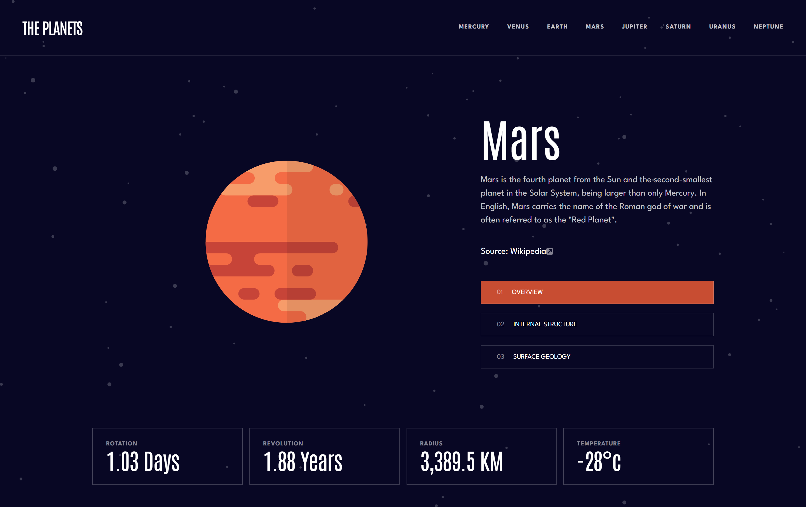

# Frontend Mentor - Planets fact site solution

This is a solution to the [Planets fact site challenge on Frontend Mentor](https://www.frontendmentor.io/challenges/planets-fact-site-gazqN8w_f). Frontend Mentor challenges help you improve your coding skills by building realistic projects. 

## Table of contents

- [Overview](#overview)
  - [The challenge](#the-challenge)
  - [Screenshot](#screenshot)
  - [Links](#links)
- [My process](#my-process)
  - [Built with](#built-with)
  - [What I learned](#what-i-learned)
  - [Useful resources](#useful-resources)
- [Author](#author)

## Overview

### The challenge

Users are be able to:

- View the optimal layout for the app depending on their device's screen size
- See hover states for all interactive elements on the page
- View each planet page and toggle between "Overview", "Internal Structure", and "Surface Geology"

### Screenshot



### Links

  (Links to be added)
- Solution URL: [Add solution URL here](https://your-solution-url.com)
- Live Site URL: [Add live site URL here](https://your-live-site-url.com)

## My process

### Built with

- Semantic HTML5 markup
- CSS
- Flexbox
- CSS Grid
- Mobile-first workflow
- [React](https://reactjs.org) - JS library
- [Vite](https://vitejs.dev) - Vite setup/bundler
- [TailwindCSS](https://tailwindcss.com) - CSS utility class library

### What I learned

This was a smaller project, so this project was more about practicing more of what I already know and about honing those skills. Although I have only just recently started using vite for my projects, instead of create-react-app. In this project I noticed I had to handle static images from objects/JSON data a bit differently than I would of done in create-react-app, where I had to use the commonJS module import "require" in order to grab the relative path to display the images. Where as in vite I had to use a "new URL" constructure in order to grab the relative path for the image that needs to be displayed. 

Here is the example of it down below...

```js
const getImgURL = (name) => {
  return new URL(`../assets/${name}`, import.meta.url).href;
};
```

### Useful resources

- [Vite Documentation](https://vitejs.dev/guide/assets.html) - Here I used the vite documentation on how to handle static assets, or more specificly on how to grab images directly from objects or JSON data.

## Author

- Website - [https://www.djhwebdevelopment.com](https://www.djhwebdevelopment.com)
- Frontend Mentor - [@David-Henery4 ](https://www.frontendmentor.io/profile/David-Henery4)
- LinkedIn - [David Henery](https://www.linkedin.com/in/david-henery-725458241)


